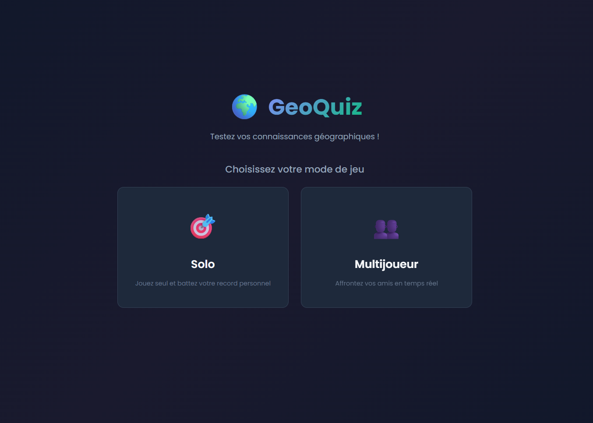
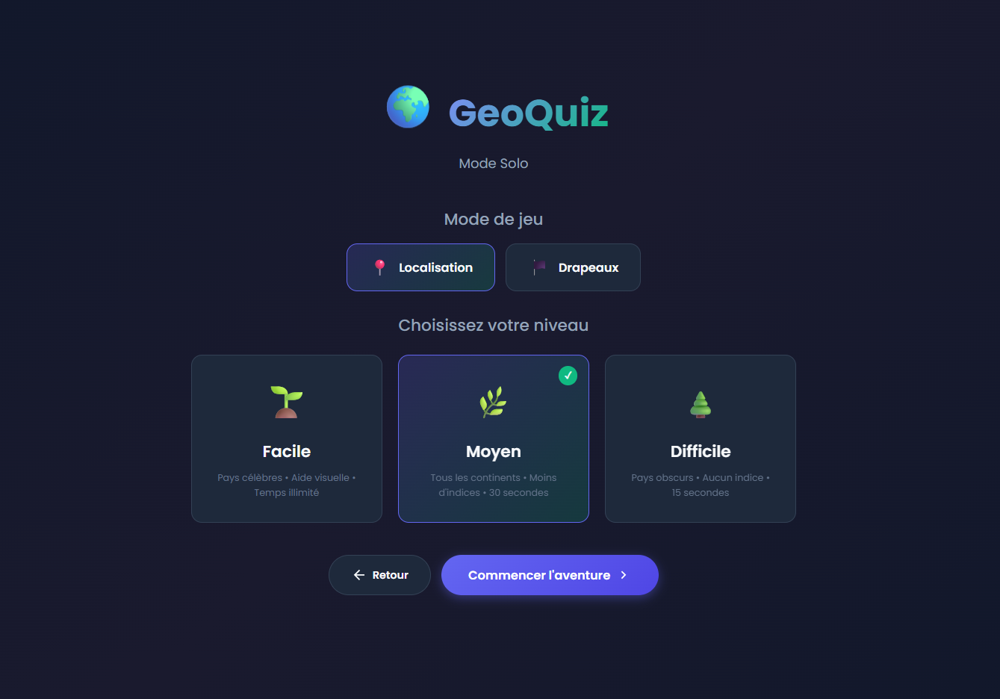
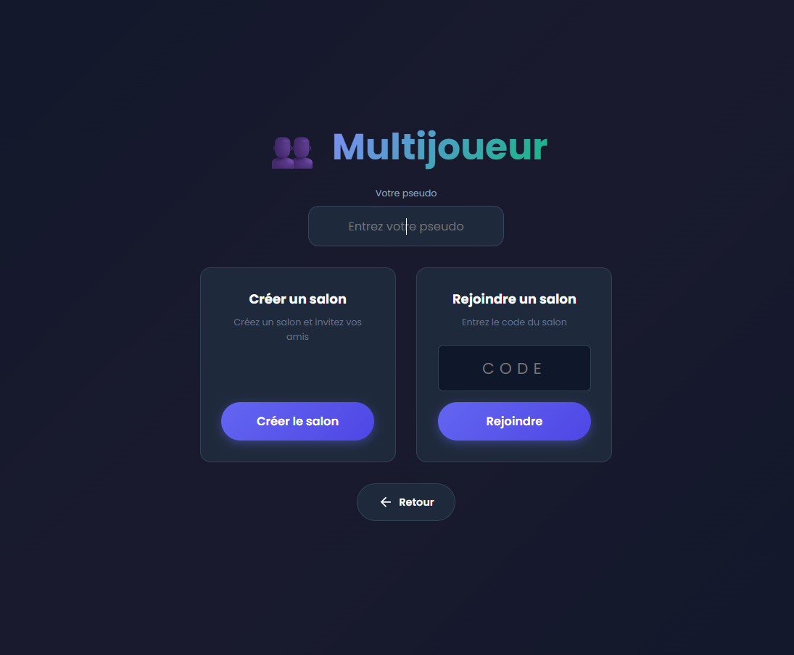
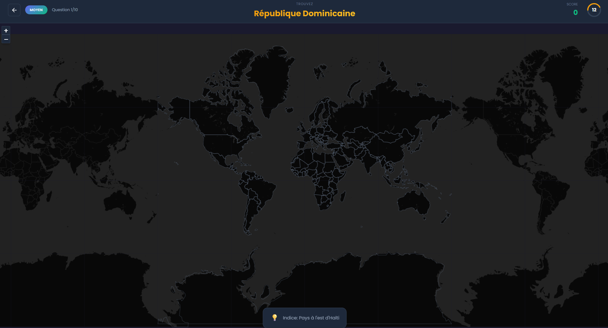
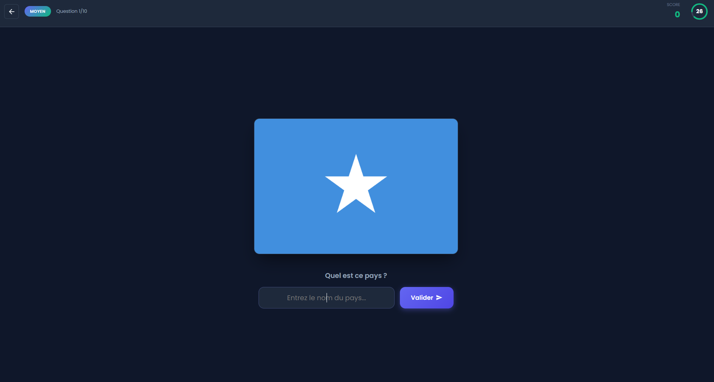

# 🌍 GeoQuiz - Jeu de Géographie Multijoueur

GeoQuiz est une plateforme interactive et ludique conçue pour tester vos connaissances géographiques. Que vous soyez seul ou entre amis, localisez les pays sur une carte du monde et grimpez au sommet du classement !



## 🚀 Fonctionnalités principales

### 🎮 Modes de Jeu
*   **Mode Solo** : Entraînez-vous à votre rythme avec trois niveaux de difficulté (Facile, Moyen, Difficile).
*   **Mode Multijoueur** : Créez des salons privés, invitez vos amis avec un code unique et affrontez-vous en temps réel jusqu'à 8 joueurs.

### 🗺️ Expérience Interactive
*   **Carte Interactive** : Utilisation de Leaflet.js pour une navigation fluide et précise.
*   **Système d'Indices** : Des aides visuelles sont disponibles selon le niveau de difficulté choisi.
*   **Phase de Révision** : Après chaque partie, visualisez les erreurs et les réussites de chaque joueur directement sur la carte.

### 🏆 Compétition et Score
*   **Calcul de précision** : Les points sont attribués en fonction de la distance entre votre clic et la position réelle du pays.
*   **Podium Final** : Un classement animé pour célébrer les vainqueurs.

---

## 📸 Aperçu du jeu

| Mode Solo | Mode Multijoueur |
|:---:|:---:|
|  |  |

| Localisation | Quiz Drapeaux |
|:---:|:---:|
|  |  |

---

## 🛠️ Installation et Lancement

### Prérequis
*   [Node.js](https://nodejs.org/) (Version 18 ou supérieure recommandée)
*   Un navigateur web moderne

### Installation locale

1.  **Cloner le dépôt** :
    ```bash
    git clone https://github.com/votre-username/geo_game.git
    cd geo_game
    ```

2.  **Installer les dépendances** :
    ```bash
    npm install
    ```

3.  **Lancer le serveur** :
    ```bash
    npm start
    ```

4.  **Accéder à l'application** :
    Ouvrez votre navigateur à l'adresse suivante : [http://localhost:3000](http://localhost:3000)

---

## 🕹️ Comment jouer ?

### En Solo
1. Choisissez votre pseudo.
2. Sélectionnez une difficulté.
3. Cliquez sur la carte pour localiser le pays demandé avant la fin du temps imparti !

### En Multijoueur
1. **L'Hôte** crée un salon et partage le code à 6 caractères généré.
2. **Les Joueurs** rejoignent le salon en utilisant le code et leur pseudo.
3. L'hôte peut configurer le nombre de questions, le temps par question et la difficulté.
4. Une fois la partie lancée, tout le monde répond aux mêmes questions simultanément.
5. Suivez la phase de révision pour voir qui a été le plus précis avant de découvrir le podium final.

---

## ⚙️ Technologies utilisées

*   **Frontend** : HTML5, CSS3 (Animations, Flexbox/Grid), JavaScript (ES6+).
*   **Cartographie** : [Leaflet.js](https://leafletjs.com/).
*   **Backend** : [Node.js](https://nodejs.org/) avec le framework [Express](https://expressjs.com/).
*   **Temps Réel** : [Socket.io](https://socket.io/) pour la communication bidirectionnelle.

---

## 📂 Structure du projet

```text
geo_game/
├── public/           # Fichiers clients (HTML, CSS, JS)
│   ├── index.html    # Interface utilisateur unique
│   ├── styles.css    # Styles et animations
│   ├── game.js       # Logique client et Socket.io
│   └── countries.js  # Données géographiques
├── server.js         # Serveur Node.js (Gestion des salons et du temps réel)
├── img/              # Captures d'écran pour la documentation
└── package.json      # Gestion des dépendances
```


---
🌍 *Prêt à relever le défi ? Rendez-vous sur GeoQuiz !*

